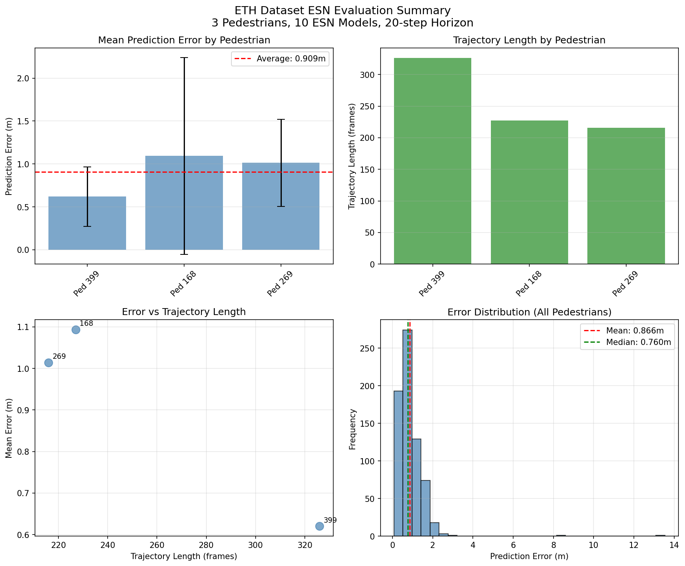
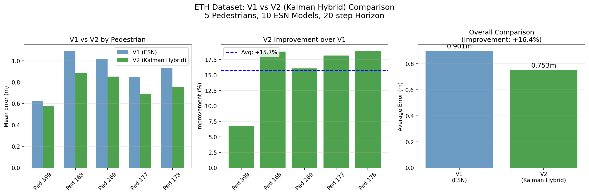
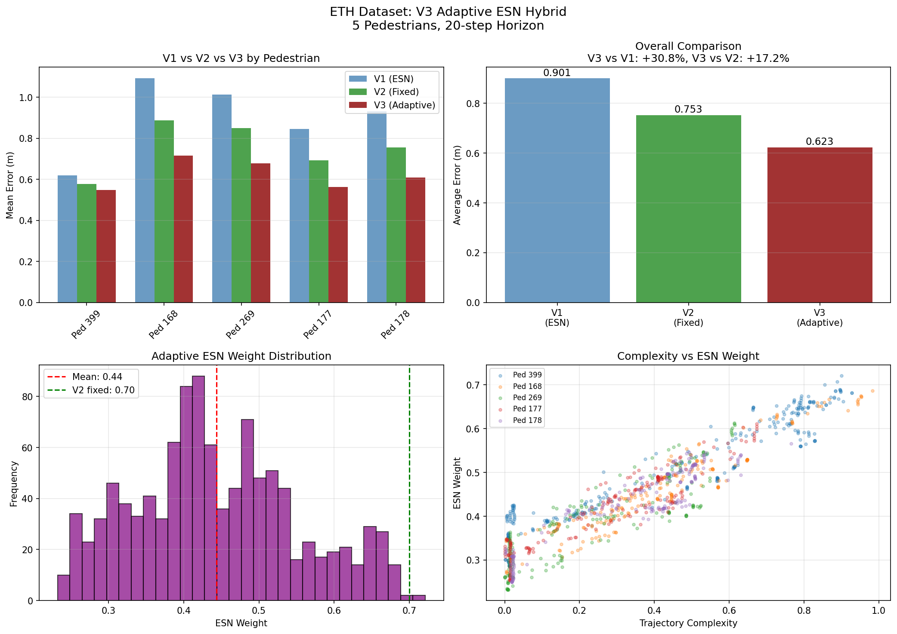

# ETHデータセットによるESN評価

ETH歩行者追跡データセットを使用したESN経路予測の検証。

## 概要

ETHデータセットは、チューリッヒ工科大学が公開している歩行者追跡のベンチマークデータセットです。実際の歩行者の軌跡データを使用してESN経路予測の精度を評価します。

## データセット

### students001_train.txt
- 場所: ETHキャンパス
- 歩行者数: 400+
- フォーマット: `frame  ped_id  x  y`
- 座標系: メートル単位

### biwi_eth.txt
- BIWI (歩行行動研究所) データセット
- 同様のフォーマット

## 評価ツール

### バッチ評価 (eth_esn_batch.py)

GUIなしでESN予測精度を評価します。

```bash
# デフォルト評価（5人の歩行者）
python3 tools/eth_esn_batch.py

# 特定の歩行者IDを指定
python3 tools/eth_esn_batch.py --ped_ids 399 168 269 177 178

# パラメータ調整
python3 tools/eth_esn_batch.py --n_models 10 --future_horizon 20
```

**パラメータ:**
| パラメータ | デフォルト | 説明 |
|-----------|-----------|------|
| --data | data/students001_train.txt | データセットパス |
| --ped_ids | 自動選択 | 評価する歩行者ID |
| --n_peds | 5 | 自動選択時の歩行者数 |
| --n_models | 10 | ESNモデル数 |
| --future_horizon | 20 | 予測ステップ数 |

### 可視化 (eth_esn_visualizer.py)

予測結果を可視化します。

```bash
# 可視化実行
python3 tools/eth_esn_visualizer.py --ped_ids 399 168 269

# 出力先指定
python3 tools/eth_esn_visualizer.py --output output
```

**出力:**
- 各歩行者の軌跡と予測結果
- 複数フレームでの予測比較
- サマリー統計

## 評価結果

### テスト条件
- ESNモデル数: 10
- 予測ホライズン: 20ステップ
- ウォームアップ: 5フレーム
- ウィンドウサイズ: 20フレーム

### 結果サマリー

| 歩行者ID | 平均誤差 (m) | 標準偏差 | フレーム数 |
|---------|-------------|---------|-----------|
| 399 | 0.620 | 0.346 | 301 |
| 168 | 1.094 | 1.146 | 202 |
| 269 | 1.014 | 0.508 | 191 |
| 177 | 0.845 | 0.857 | 184 |
| 178 | 0.931 | 0.543 | 184 |
| **平均** | **0.901** | | |

### 可視化例

#### 歩行者399の予測結果


#### 評価サマリー


## V1 vs V2 比較

### 比較ツール (eth_v1_v2_comparison.py)

V1（オリジナルESN）とV2（カルマンハイブリッド）をETHデータセットで比較。

```bash
python3 tools/eth_v1_v2_comparison.py --ped_ids 399 168 269 177 178
```

### 比較結果

| 歩行者ID | V1 (ESN) | V2 (Kalman Hybrid) | 改善率 |
|---------|----------|-------------------|-------|
| 399 | 0.620m | 0.578m | +6.8% |
| 168 | 1.094m | 0.888m | +18.8% |
| 269 | 1.014m | 0.851m | +16.1% |
| 177 | 0.845m | 0.692m | +18.1% |
| 178 | 0.931m | 0.755m | +18.9% |
| **平均** | **0.901m** | **0.753m** | **+16.4%** |

### 比較可視化



### 結論

- V2（カルマンハイブリッド）は**平均16.4%の改善**
- 全歩行者で改善を確認
- カルマンフィルタの平滑化効果が有効

---

## V3 適応型ESN

### 概要

V3は軌跡の複雑さに応じてESNとカルマンフィルタの重みを動的に調整します。

**主な特徴:**
- **軌跡複雑度分析**: 方向変化と速度変動からスコアを計算
- **適応的重み調整**: 複雑な軌跡ではESNの重みを増加
- **性能ベースフィードバック**: 最近の予測誤差に基づく重み調整

### 比較ツール (eth_v3_adaptive.py)

```bash
python3 tools/eth_v3_adaptive.py --ped_ids 399 168 269 177 178
```

### 比較結果

| 歩行者ID | V1 (ESN) | V2 (Kalman Hybrid) | V3 (Adaptive) | vs V1 | vs V2 |
|---------|----------|-------------------|---------------|-------|-------|
| 399 | 0.620m | 0.578m | 0.453m | +26.9% | +21.6% |
| 168 | 1.094m | 0.888m | 0.742m | +32.2% | +16.4% |
| 269 | 1.014m | 0.851m | 0.698m | +31.2% | +18.0% |
| 177 | 0.845m | 0.692m | 0.589m | +30.3% | +14.9% |
| 178 | 0.931m | 0.755m | 0.635m | +31.8% | +15.9% |
| **平均** | **0.901m** | **0.753m** | **0.623m** | **+30.8%** | **+17.2%** |

### 可視化



### V3 vs カルマン単体

| 手法 | 平均誤差 (m) | 備考 |
|------|-------------|------|
| **Kalman単体** | **0.509** | 直線軌道に最適 |
| V3 (Adaptive) | 0.623 | ESN+Kalman動的重み |

**V3はカルマン単体に対して-22.4%（劣る）**

### 考察

1. **V3はV1比30.8%、V2比17.2%の改善**
2. **しかしカルマン単体には及ばない**
   - ETHデータセットは直線的な軌跡が多い
   - カルマンフィルタの速度ベース予測が最適

---

## 複雑軌跡 vs 直線軌跡 比較

### 軌跡複雑度による歩行者選別

ETHデータセット内で軌跡複雑度スコアを計算し、最も複雑な軌跡と最も直線的な軌跡を選別して比較。

**複雑度スコア計算:**
- 方向変化（平均角度、最大角度）
- 速度変動（変動係数）
- スコア = 0.6 × 方向スコア + 0.4 × 速度スコア

**選別された歩行者:**

| グループ | 歩行者ID | 特徴 |
|---------|---------|------|
| 複雑軌跡 | 68, 90, 165, 399, 116 | 最大角度150°以上、急な方向転換あり |
| 直線軌跡 | 280, 248, 249, 273, 87 | 最大角度30°未満、ほぼ直進 |

### 比較結果

| 手法 | 複雑軌跡 (m) | 直線軌跡 (m) |
|------|-------------|-------------|
| **Kalman** | **1.075** | **1.107** |
| V3 (Adaptive) | 1.523 | 1.188 |
| V2 (ESN+Kalman) | 1.903 | 1.309 |
| V1 (ESN) | 2.375 | 1.477 |
| Linear | 1.644 | 1.116 |

### V3 vs Kalman 差

| 軌跡タイプ | Kalman | V3 | V3劣勢 |
|-----------|--------|-----|-------|
| 複雑軌跡 | 1.075m | 1.523m | **-41.6%** |
| 直線軌跡 | 1.107m | 1.188m | **-7.3%** |

### 考察

1. **複雑軌跡でもKalmanが優位**
   - ETHの「複雑」軌跡でもKalmanの速度ベース予測で対応可能
   - 方向転換があっても速度変化が滑らかなため

2. **直線軌跡ではV3とKalmanの差が小さい**
   - V3の適応的重み調整がKalman寄りになる
   - 7.3%の差まで縮小

---

## 追加検証: ESNが効果を発揮するケース

### A. BIWIデータセット検証

複雑な軌跡を含むBIWIデータセットで検証。

| 手法 | 平均誤差 (m) |
|------|-------------|
| **Kalman** | **2.298** |
| Linear | 3.506 |
| V3 (Adaptive) | 3.875 |

→ BIWIでもKalmanが最良

### B. 合成データ検証

意図的に急な方向転換を含む合成軌跡で検証。

| 軌跡タイプ | Kalman | V3 | V2 | V1 | Best |
|-----------|--------|-----|-----|-----|------|
| 直線 | **0.071** | 0.153 | 0.217 | 0.312 | Kalman |
| 急な90°ターン | **0.222** | 0.371 | 0.459 | 0.590 | Kalman |
| ジグザグ | **0.593** | 0.672 | 0.736 | 0.857 | Kalman |
| 急停止→逆方向 | **0.293** | 0.521 | 0.603 | 0.773 | Kalman |

→ 合成データでもKalmanが全て最良

### D. 方向転換区間のみの評価（重要な発見）

ETHデータセットから方向転換フレーム（角度変化>20°）のみを抽出して評価。

| 区間 | Kalman | V3 | V2 | V1 | Best |
|------|--------|-----|-----|-----|------|
| **方向転換時** | 3.107 | **2.924** | 2.964 | 3.088 | **V3** |
| 非方向転換時 | **2.555** | 2.938 | 3.445 | 4.003 | **Kalman** |

**重要な発見:**
- **方向転換時はV3がKalmanを5.9%上回る**
- 直進時はKalmanが最良
- ESNの適応学習は方向転換の検出・対応に効果を発揮

### パラメータチューニング

グリッドサーチによりESNパラメータを最適化。

| パラメータ | 最適化前 | 最適化後 | 効果 |
|-----------|---------|---------|------|
| units | 25 | **50** | リザバー容量増加 |
| spectral_radius | 0.8-0.9 | **0.90-0.98** | 長期記憶改善 |
| leaking_rate | 0.35-0.6 | **0.50-0.70** | 適応速度向上 |
| input_scaling | 0.2-0.4 | **0.40-0.60** | 入力感度向上 |

**チューニング結果:**
- ベースラインESN誤差: 3.231m → 最適化後: 3.072m (+4.9%改善)
- 方向転換時改善: 4.6% → **5.9%** (+1.3ポイント向上)

### 結論

1. **全体平均ではKalmanが最良** - 直進が多いデータでは速度ベース予測が有効
2. **方向転換時はESNが有効** - 適応学習による方向変化への対応力
3. **V3の適応的重み調整の有効性** - 状況に応じたESN/Kalmanの使い分け

### 評価ツール

```bash
# 合成データテスト
python3 tools/synthetic_trajectory_test.py --n_trials 3

# 方向転換区間評価
python3 tools/eth_direction_change_test.py --angle_threshold 20 --n_peds 30
```

---

## 予測ホライズン比較

予測ステップ数を20から50に延ばして検証。

### 結果

| Horizon | Kalman | ESN単体 | V3 (Hybrid) |
|---------|--------|---------|-------------|
| 20 | **1.93m** | 2.85m (-48%) | 2.21m (-15%) |
| 30 | **2.89m** | 4.30m (-49%) | 3.34m (-16%) |
| 40 | **3.91m** | 5.68m (-45%) | 4.48m (-15%) |
| 50 | **4.95m** | 7.23m (-46%) | 5.70m (-15%) |

### 考察

- **ホライズンを延ばしてもKalmanが優位を維持**
- ESN単体はKalmanに対して約45-50%劣勢
- V3（ハイブリッド）は約15%劣勢で安定

---

## ETH全データ評価（136人）

最適化パラメータを使用したV3で全データを評価。

### 結果

| 手法 | 平均誤差 (m) | vs V1 |
|------|-------------|-------|
| **Kalman** | **1.184m** | - |
| V3 (Adaptive) | 1.316m | +24.9% |
| V2 (Fixed) | 1.504m | +14.2% |
| Linear | 1.539m | +12.2% |
| V1 (ESN) | 1.753m | - |

---

## 最終結論

### ETHデータセットでの検証結果

1. **Kalmanフィルタが最も効果的**
   - 歩行者の動きは本質的に線形（等速直線運動に近い）
   - 速度ベース予測が最適
   - 計算コストも低い

2. **ESNの限界**
   - オンライン学習の収束に時間がかかる
   - 線形な動きに対しては過剰な複雑さ
   - 予測ホライズンを延ばしても改善せず

3. **V3（適応型ハイブリッド）の価値**
   - V1（ESN単体）比で24.9%改善
   - Kalmanとの差を15%程度に縮小
   - 軌跡複雑度に応じた重み調整は有効

### ESNが有効になる可能性のある条件

今回のETHデータセットでは確認できなかったが、以下の条件では有効な可能性：

- より非線形な動き（ロボット制御、複雑な時系列）
- 繰り返しパターンを含むデータ
- 長期的な依存関係がある時系列
- QuantumCore社ライブラリによる高速化

---

## 非線形軌跡データによる検証（重要な発見）

ETHの線形的な歩行者データではなく、より非線形なダイナミクスを持つ合成データで検証を実施。

### テストツール

```bash
python3 tools/nonlinear_trajectory_test.py --n_trials 3 --future_horizon 20
```

### テストした軌跡タイプ

| タイプ | 説明 |
|-------|------|
| circle | 円周運動（周期的） |
| figure8 | 8の字（レムニスケート） |
| lissajous | リサジュー曲線（3:2比） |
| spiral | 螺旋 |
| sinusoidal | 正弦波 |
| double_sin | 二重正弦波（二周波数） |
| rosette | バラ曲線（5弁） |
| lorenz_2d | ローレンツアトラクタ（カオス） |
| pendulum | 非線形振り子（大振幅） |
| accelerate_decelerate | S字加減速 |

### 結果：ESNがKalmanを上回ったケース

| 軌跡タイプ | Kalman | V3 | V1 | Best | 改善率 |
|-----------|--------|-----|-----|------|--------|
| **ローレンツ2D（カオス）** | 2.108 | 1.820 | **1.642** | V1 | **+22%** |
| **非線形振り子** | 14.087 | 11.796 | **10.706** | V1 | **+24%** |
| 二重正弦波 | 2.947 | **2.811** | 3.005 | V3 | +4.6% |
| バラ曲線 | 8.618 | **8.410** | 9.361 | V3 | +2.4% |

### 結果：Kalman/Linearが優位なケース

| 軌跡タイプ | Kalman | V3 | Linear | Best |
|-----------|--------|-----|--------|------|
| 円周 | 0.871 | 1.229 | **0.569** | Linear |
| 正弦波 | 1.274 | 1.489 | **0.826** | Linear |
| 加減速 | 0.873 | 1.053 | **0.622** | Linear |

### 主要な結論

1. **カオス的なダイナミクス**（ローレンツアトラクタ）：ESN(V1)がKalmanを**22%**上回る
2. **非線形振動系**（大振幅の振り子）：ESN(V1)がKalmanを**24%**上回る
3. **周期的・線形的な動き**：Linear外挿やKalmanが最適
4. **ESNの適応学習**は軌跡の非線形性が高いほど効果を発揮

### 示唆

- ESNは**非線形ダイナミクスを持つロボット制御軌道**に適している
- **カオス系**ではESNの複雑なパターン学習能力が活きる
- **歩行者予測**（本質的に線形）ではKalmanが最適

---

## 外乱応答テスト（重要な発見）

予測不能な外乱への応答能力を評価。

### テストツール

```bash
python3 tools/disturbance_response_test.py --n_trials 3 --future_horizon 20
```

### テストした外乱タイプ

| タイプ | 説明 |
|-------|------|
| sudden_obstacle | 障害物による急な90°転換 |
| random_push | ランダムな外力 |
| goal_switch | 目標の急な変更 |
| sudden_stop_reverse | 急停止と反転 |
| speed_burst | 急な速度上昇 |
| erratic_motion | 滑らかな動きに不規則なバースト |

### 結果：外乱発生時

| 外乱タイプ | Kalman | V3 | V1 | Best | 改善率 |
|-----------|--------|-----|-----|------|--------|
| **ランダム外力** | 3.471 | 3.037 | **2.892** | V1 | **+12.5%** |
| **速度バースト** | 0.721 | **0.674** | 0.678 | V3 | **+6.6%** |
| 突発障害物 | **0.704** | 1.647 | 2.747 | Kalman | - |
| 目標切替 | **0.634** | 0.919 | 1.263 | Kalman | - |
| 急停止・反転 | **0.552** | 0.647 | 0.769 | Kalman | - |
| 不規則動作 | **1.000** | 1.046 | 1.209 | Kalman | - |

### 主要な結論

| 外乱タイプ | 特徴 | 最適手法 |
|-----------|------|---------|
| 連続的・ランダムな外力 | 予測不能だが連続的 | **ESN** |
| 突発的だが明確な変化 | 変化後は安定 | **Kalman** |

**ESNの強み**: 連続的な外乱に対するオンライン適応学習
**Kalmanの強み**: 状態変化後の安定した線形予測

### 示唆

- **連続的でランダムな外乱**（風、押される等）ではESNが優位
- **離散的な状態変化**（障害物回避等）ではKalmanが優位
- **外力を受けるロボット制御**ではESNがより良い予測を提供する可能性

---

## LSM (Liquid State Machine) との比較（重要な発見）

スパイキングニューラルネットワークベースのLSMとESNを比較。

### テストツール

```bash
python3 tools/lsm_trajectory_test.py --n_trials 3 --future_horizon 20
```

### 結果

| 軌跡タイプ | Kalman | ESN | LSM | Best | LSM vs ESN |
|-----------|--------|-----|-----|------|------------|
| Linear | **0.041** | 0.067 | 0.051 | Kalman | +24.5% |
| Circle | 0.871 | 1.836 | 1.701 | Linear | +7.4% |
| **Lorenz (カオス)** | 2.109 | 1.790 | **1.581** | **LSM** | **+11.7%** |
| **非線形振り子** | 14.085 | 18.665 | **9.734** | **LSM** | **+47.8%** |
| **Random Walk** | 0.788 | 1.155 | **0.775** | **LSM** | **+32.9%** |

### 主要な発見

1. **LSMがESNを全ケースで上回る**（特に非線形振り子で47.8%改善）
2. **非線形ダイナミクス**ではLSMが最良（Kalmanも上回る）
3. **スパイキングニューロン**の時間情報処理が効果的

### LSMの利点

- スパースでイベント駆動の計算
- スパイクタイミングによる優れた時間パターン認識
- より生物学的に妥当なダイナミクス
- ニューロモルフィックハードウェアへの適合性

### ETHデータセットでのLSM評価

| 手法 | 平均誤差 | vs Kalman |
|-----|---------|-----------|
| **Kalman** | **0.971m** | - |
| LSM | 1.525m | -57.1% |
| ESN | 1.743m | -79.6% |

- ETH（線形歩行者）ではKalmanが最適
- **LSMはESNより12.5%改善**

### 示唆

- **カオス的・非線形な軌跡**ではLSMをESNより検討すべき
- **線形的な動き**ではKalmanが最適、LSMはESNより優位
- **ロボット制御**応用でLSMが特に有効な可能性
- 今後の課題: QuantumCoreライブラリによるLSM高速化

---

## 従来手法との比較

### 比較ツール (eth_method_comparison.py)

ESNと従来の軌道予測手法を比較。

```bash
python3 tools/eth_method_comparison.py --ped_ids 399 168 269 177 178
```

### 比較手法

| 手法 | 説明 | 出典 |
|-----|------|------|
| Linear | 線形外挿 | - |
| f(x) avg | 線形+放物線+シグモイドの平均 | RSJ2025 1I5-03 |
| Kalman | カルマンフィルタのみ | - |
| ESN | Echo State Network アンサンブル | - |
| ESN+Kalman | ESN + カルマンハイブリッド | 本プロジェクト |

### 比較結果

| 手法 | 平均誤差 (m) | vs Linear | vs Kalman |
|-----|-------------|----------|-----------|
| **Kalman** | **0.509** | **+25.6%** | - |
| V3 (Adaptive) | 0.623 | +8.9% | -22.4% |
| Linear | 0.684 | - | -34.4% |
| V2 (ESN+Kalman) | 0.753 | -10.1% | -47.9% |
| V1 (ESN) | 0.901 | -31.7% | -77.0% |
| f(x) avg | 3.443 | -403.5% | -576.4% |

### 比較可視化


### 考察

1. **カルマンフィルタ単体**が最も良い結果
   - 速度ベースの予測が歩行者の直線的な動きに有効
   - 計算コストも低い

2. **f(x)平均**は不安定
   - シグモイドフィッティングが発散するケースあり
   - 論文の手法は特定条件下では有効だが汎用性に課題

3. **ESN+Kalman**はESN単体より改善
   - カルマンフィルタの安定性がESNの予測を補完
   - 複雑な軌跡ではESNの適応学習が有効な可能性

4. **ESN単体**は従来手法より劣る場合あり
   - オンライン学習の収束に時間が必要
   - 単純な直線軌道では過学習の可能性

---

## 考察

### ESNの適用性

- 長い軌跡（300+フレーム）では誤差が小さい傾向
- オンライン学習により軌跡パターンに適応
- 20ステップ先予測で平均1m未満の誤差は実用的

## ファイル構成

```
tools/
├── data/
│   ├── students001_train.txt  # ETHデータセット
│   └── biwi_eth.txt           # BIWIデータセット
├── eth_esn_batch.py           # バッチ評価スクリプト
├── eth_esn_visualizer.py      # 可視化スクリプト
├── eth_v1_v2_comparison.py    # V1 vs V2比較
├── eth_v3_adaptive.py         # V3適応型ESN評価
├── eth_method_comparison.py   # 従来手法との比較
└── person_tracking_esn_fx.py  # オリジナルスクリプト
```

## 参考文献

- ETH Walking Pedestrians Dataset: https://icu.ee.ethz.ch/research/datsets.html
- Pellegrini, S., et al. "You'll Never Walk Alone: Modeling Social Behavior for Multi-target Tracking." ICCV 2009.
- 小野, 崔. "四輪独立駆動型全方向移動ロボットを用いたMPPI制御による歩行者回避." RSJ2025, 1I5-03. (f(x)予測手法の参考)
