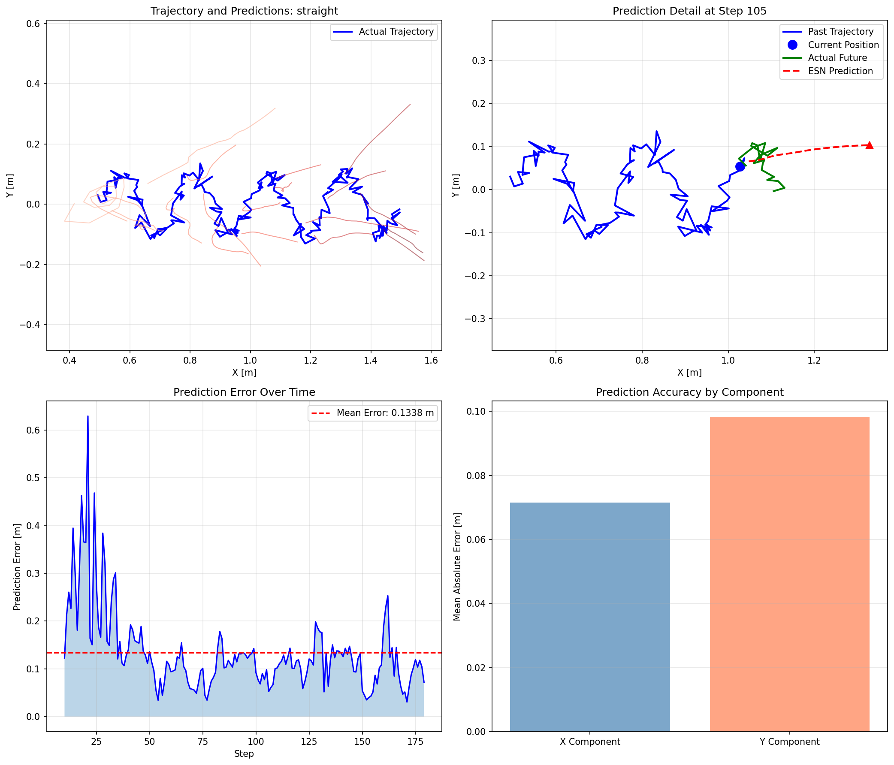
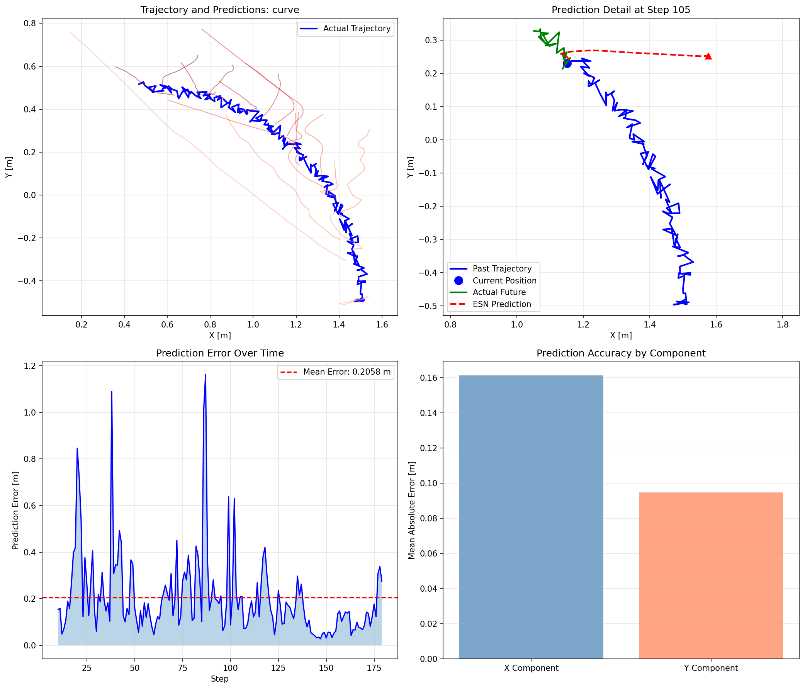

# ESN経路予測 検証結果

Echo State Network（ESN）による経路予測アルゴリズムの検証結果。

## 検証概要

- **ESNモデル数**: 10（アンサンブル）
- **予測ホライズン**: 20ステップ
- **ウォームアップ**: 5サンプル
- **軌跡長**: 200ステップ
- **ノイズレベル**: 0.015m

## 精度サマリー


| パターン | 平均誤差 | 標準偏差 | 評価 |
|---------|---------|---------|------|
| straight | 0.134 m | 0.086 m | 優秀 |
| stop_and_go | 0.180 m | 0.177 m | 良好 |
| curve | 0.206 m | 0.179 m | 良好 |
| zigzag | 0.363 m | 0.250 m | 要改善 |

## パターン別詳細結果

### 1. 直線歩行（straight）



**特徴:**
- 最も高い予測精度
- X成分（前進方向）の予測が特に安定
- Y成分（横方向）の微小な揺れも捕捉

**分析:**
- 平均誤差: 0.134 m
- 直線的な動きはESNが得意とするパターン
- オンライン適応が効果的に機能

---

### 2. 曲線歩行（curve）



**特徴:**
- 曲がり始めの予測にやや遅延
- 曲率の変化に追従
- 中盤以降で精度向上

**分析:**
- 平均誤差: 0.206 m
- 曲がる方向の予測が課題
- 適応学習により徐々に改善

---

### 3. ジグザグ歩行（zigzag）


**特徴:**
- 周期的な方向転換の予測が困難
- Y成分の誤差が顕著
- 転換点での誤差ピーク

**分析:**
- 平均誤差: 0.363 m
- 急激な方向変化への対応が課題
- 予測ホライズンの短縮が有効な可能性

---

### 4. 停止と移動（stop_and_go）


**特徴:**
- 停止期間中は高精度
- 移動再開時に一時的な誤差増加
- 適応学習で速やかに回復

**分析:**
- 平均誤差: 0.180 m
- 停止検出は良好
- 動き出しの予測に改善余地

---

## 考察

### 強み
1. **直線的な動き**: 高精度で予測可能
2. **オンライン適応**: リアルタイムでモデル更新
3. **アンサンブル効果**: 複数モデルの平均化で安定性向上

### 課題
1. **急激な方向転換**: 予測遅延が発生
2. **周期的パターン**: 長周期の変動への対応
3. **動き出し**: 静止から動への遷移

### 改善案
1. 予測ホライズンの動的調整
2. 方向転換検出の強化
3. 速度情報の追加入力

## 検証環境

- **OS**: Ubuntu 22.04
- **Python**: 3.10
- **依存ライブラリ**: NumPy, SciPy, Matplotlib
- **実行スクリプト**: `tools/esn_visualizer.py`

## 再現方法

```bash
python3 tools/esn_visualizer.py --pattern all --output output
```
